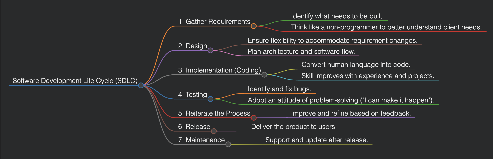

# Software Engineering (CSE327)

## Lecture 1 (Date: 21/01/25)

### Introduction to Software Engineering (SWE)

**Definition of Software Engineering:**
Software engineering is the process of creating software that can be maintained and managed primarily by those who develop it. The goal is not to create the best or most visually appealing software but to maximize monetary returns over the longest period.

**Key Principles Derived from This Definition:**
- Focus on profitability rather than perfection.
- Prove software correctness only when necessary or financially feasible.
- Maximize returns by writing less code and making informed decisions.

---

### Steps of Software Engineering



---

### Key Observations

- **Cost Reduction:** Computing and software have become cheaper over time.
- **Software Utilization:** A large percentage of sold software is not actually used by clients (only around 20%).
- **Failure Rate:** Around 40-50% of software projects fail, meaning they are not adopted by users.
- **Revenue Sources:** About 60% of revenue comes from the maintenance phase, emphasizing long-term client support.

**Challenges:**
- Most of our education focuses on writing new code, whereas real-world SWE involves maintaining existing codebases (90% of the job).
- Writing maintainable code is crucial to enable delegation and career growth.

**Key Goals of SWE:**
1. Make software **easy to maintain.**
2. Ensure features can be **easily added/removed.**

---

### Design Patterns

Design patterns are established solutions to common software design problems. They help in:
- Ensuring code consistency and maintainability.
- Recognizing common structures like use case diagrams, window decorators, etc.

**Popular Software Development Models:**
1. **Waterfall Model:**
   - Sequential development model.
   - Each phase must be completed before moving to the next.

2. **Iterative and Incremental Model:**
   - Develop the software in cycles.
   - Allows feedback and improvement in each cycle.

---

### UML Class Diagrams

**Unified Modeling Language (UML) Class Diagram:**
UML class diagrams represent the static structure of a system by depicting:

- **Classes:** Represent the blueprint of objects with attributes and methods.
- **Attributes:** Variables that define the properties of a class.
- **Methods:** Functions that define the behavior of a class.
- **Relationships:** Define the interaction between classes.

#### Key Components:
1. **Classes:**
   - Represented by a rectangular box with three compartments:
     - Class Name (e.g., `Student`)
     - Attributes (e.g., `name: String`, `age: int`)
     - Methods (e.g., `getDetails(): String`)

2. **Relationships:**
   - **Association:** Represents a "uses" relationship.
   - **Inheritance (Generalization):** Represents an "is-a" relationship.
   - **Aggregation:** Represents a "whole-part" relationship.
   - **Composition:** A stronger form of aggregation, where parts cannot exist without the whole.
   
#### Example UML Class Diagram:
```
+----------------+
|   Student      |
+----------------+
| - name: String |
| - age: int     |
+----------------+
| + getDetails() |
+----------------+
         ^
         |
+----------------+
|    Person      |
+----------------+
| - id: int      |
| - addr: String |
+----------------+
| + getInfo()    |
+----------------+
```

#### Advantages of UML Class Diagrams:
- Clear visualization of system structure.
- Better communication among stakeholders.
- Easier maintainability and extensibility.

---

### Important Exam Patterns

- **Midterm:** Case study-based questions requiring:
  - UML class diagram design.
  - Implementation of the design.
- **Final Exam:**
  - Identify up to three design patterns from a case study.
  - Design UML class diagrams.
  - Implementations and critical thinking application.

**Upcoming Milestone:**
- **Demo 1 of the Google Drive Aggregator Project** (due in 2 weeks from 26/01/25, so 09/02/25). More details will be provided later.

---