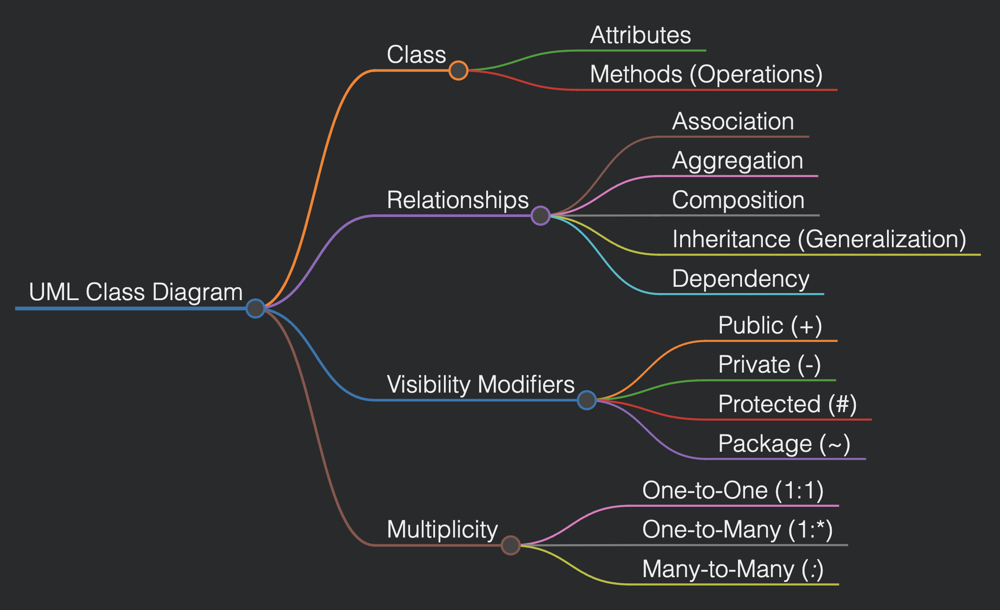

# UML Class Diagrams - Comprehensive Guide

## Introduction

**Unified Modeling Language (UML)** is a standardized modeling language used in software engineering to visualize, specify, construct, and document system artifacts. Among the various UML diagrams, the **UML Class Diagram** is one of the most commonly used to represent the static structure of a system.

UML Class Diagrams provide a **blueprint** of the system by illustrating its classes, attributes, operations, and relationships between objects.

---

## Purpose of UML Class Diagrams in Software Engineering

- **System Design and Visualization:** Provides an overview of the system’s structure.
- **Communication Tool:** Helps stakeholders understand the system.
- **Code Generation:** Many modern tools can generate code from UML diagrams.
- **System Documentation:** Acts as a reference for developers and maintainers.
- **Encapsulation of Complexity:** Abstracts system components for better maintainability.

---

## Key Components of UML Class Diagrams



### 1. Class
A **class** in UML represents a blueprint of an object and consists of three parts:

```
+----------------+
|    ClassName   |
+----------------+
| - attribute1   |
| - attribute2   |
+----------------+
| + method1()    |
| + method2()    |
+----------------+
```

#### Elements of a Class:
- **Class Name:** The name of the class (e.g., `Student`).
- **Attributes:** Define the properties of a class (e.g., `name: String`).
- **Methods (Operations):** Define the behavior of the class (e.g., `getDetails(): String`).

---

### 2. Relationships
Relationships between classes define how they interact with each other.

#### a. Association
- Represents a general connection between two classes.
- Example: A `Teacher` is associated with `Courses`.
- Notation: A solid line between two classes.

#### b. Aggregation
- A "has-a" relationship where the child class can exist independently of the parent.
- Example: A `Library` contains `Books`.
- Notation: A hollow diamond pointing to the whole.

#### c. Composition
- A strong "has-a" relationship where the child class cannot exist independently.
- Example: A `Car` has `Engine`.
- Notation: A filled diamond pointing to the whole.

#### d. Inheritance (Generalization)
- Represents an "is-a" relationship.
- Example: `Car` is a `Vehicle`.
- Notation: A solid line with a hollow triangle pointing to the parent class.

#### e. Dependency
- Represents a weak relationship where one class depends on another.
- Example: `Payment` depends on `Invoice`.
- Notation: A dashed line with an arrow.

---

### 3. Visibility Modifiers
Visibility defines the access level of class members.

| Symbol | Visibility  | Description                       |
|--------|-------------|-----------------------------------|
| `+`    | Public       | Accessible from anywhere.         |
| `-`    | Private      | Accessible only within the class. |
| `#`    | Protected    | Accessible in derived classes.    |
| `~`    | Package      | Accessible within the package.    |

---

### 4. Multiplicity
Multiplicity defines how many instances of a class can be associated with another class.

| Multiplicity | Description                  |
|--------------|------------------------------|
| 1            | One-to-one                    |
| 0..1         | Zero or one                   |
| 1..*         | One-to-many                   |
| *            | Many-to-many                  |

---

## Example UML Class Diagram

```
+----------------+
|    Student     |
+----------------+
| - name: String |
| - age: int     |
+----------------+
| + getDetails() |
+----------------+
         ^
         |
+----------------+
|    Person      |
+----------------+
| - id: int      |
| - addr: String |
+----------------+
| + getInfo()    |
+----------------+
```

---

## Use of UML Class Diagrams in Software Development Lifecycle

**1. Requirement Analysis Phase:**
   - Helps in visualizing system requirements.

**2. Design Phase:**
   - Defines high-level architecture and system flow.

**3. Implementation Phase:**
   - Serves as a reference for writing code.

**4. Maintenance Phase:**
   - Eases understanding for future modifications.

---

## Common Design Patterns with UML Class Diagrams

**1. Singleton Pattern:** Ensures a class has only one instance.
**2. Factory Pattern:** Creates objects without specifying the exact class.
**3. Observer Pattern:** Establishes a one-to-many dependency between objects.

---

## Tools for Creating UML Class Diagrams

- **Online Tools:** Lucidchart, Draw.io, Creately
- **Software IDE Plugins:** Visual Paradigm, StarUML, Enterprise Architect
- **Programming Language Support:** Python (UML libraries), Java (PlantUML)

---

## Best Practices for UML Class Diagrams

1. **Keep it Simple:** Avoid adding too many details to maintain clarity.
2. **Consistent Naming:** Use meaningful and consistent names for classes and attributes.
3. **Focus on Key Components:** Only model essential classes and relationships.
4. **Modular Design:** Break down complex systems into smaller, understandable components.

---

## Conclusion

UML Class Diagrams are an essential part of software engineering that help in visualizing and designing software systems efficiently. Mastering class diagrams allows engineers to design scalable and maintainable applications, improving communication among stakeholders and reducing system complexity.

---